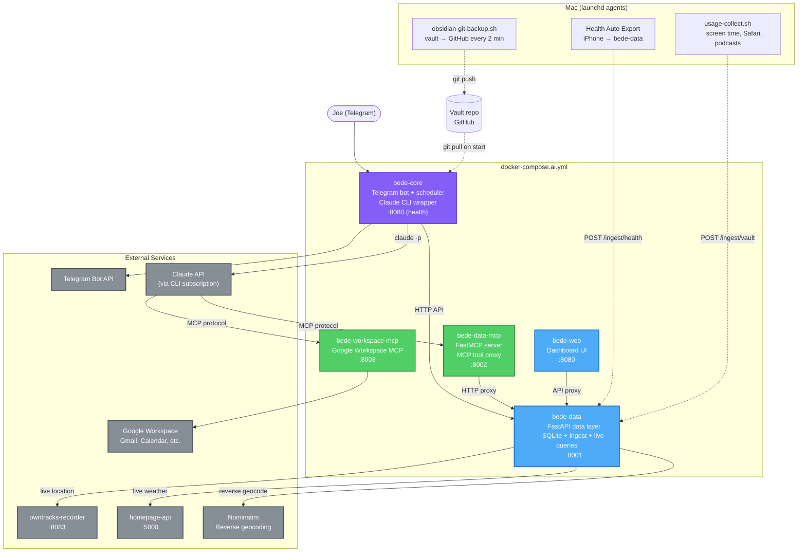
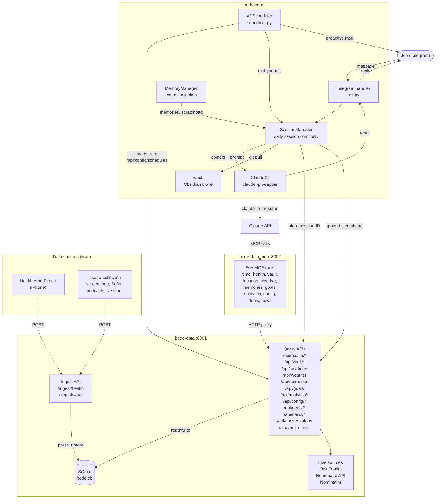
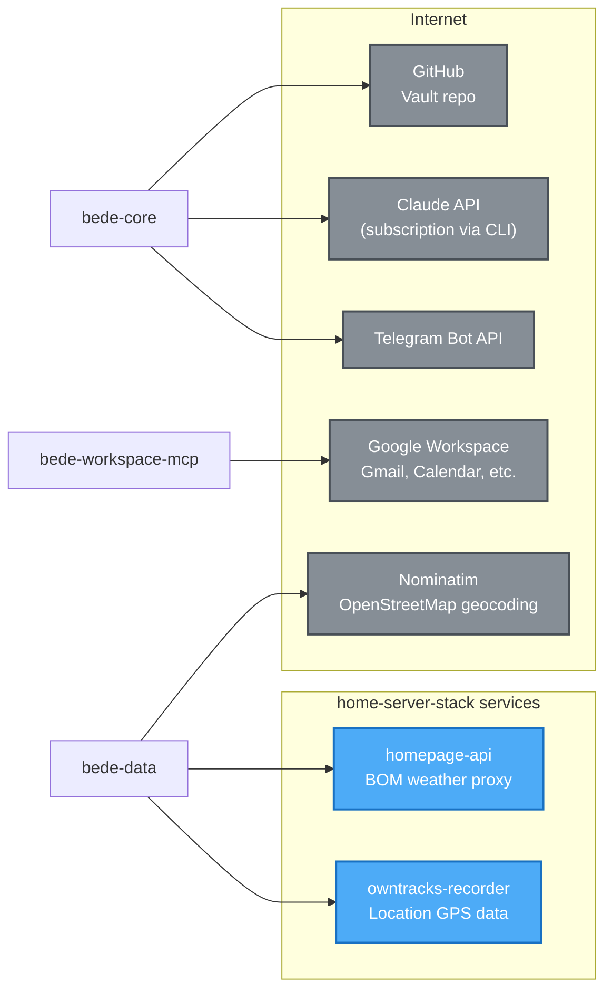

# Bede Architecture

Five Docker services — brain, data layer, MCP proxies, and dashboard — deployed as prebuilt GHCR images via the home-server-stack `docker-compose.ai.yml`.

## Table of Contents
- [Service Overview](#service-overview)
- [Data Flow](#data-flow)
- [Service Details](#service-details)
- [External Dependencies](#external-dependencies)
- [Data Persistence](#data-persistence)

---

## Service Overview



---

## Data Flow



---

## Service Details

### bede-core

The brain. Handles Telegram interaction, Claude CLI invocation, session continuity, and scheduled tasks.

| Component | Purpose |
|-----------|---------|
| `bot.py` | Telegram long-polling handler, `/start`, `/reset`, message routing |
| `scheduler.py` | APScheduler cron — loads task definitions from DB via bede-data API, fires prompts |
| `session_manager.py` | Daily session continuity via bede-data, scratchpad, vault pull |
| `claude_cli.py` | Subprocess wrapper for `claude -p --resume --output-format json` |
| `memory_manager.py` | Injects active memories and scratchpad context into prompts |
| `reflection.py` | Post-conversation correction detection |
| `quiet_hours.py` | Suppresses scheduled task output during configured hours |
| `telegram_format.py` | Markdown → Telegram HTML conversion, message chunking |
| `config.py` | Pydantic settings from environment variables |

**Key behaviour:** Each day uses a single Claude session ID (stored in bede-data). Follow-up messages resume the session; `/reset` clears it. Scheduled tasks share the daily session so Claude has conversational context across interactions.

**MCP discovery:** Claude CLI auto-discovers `mcp.json` in `/app`, which points to `http://bede-data-mcp:8002/mcp` on the Docker network.

### bede-data

The data layer. FastAPI service handling ingest, storage, querying, and live data proxying.

| Module | Purpose |
|--------|---------|
| `ingest/` | Token-authenticated endpoints for health and vault data ingestion |
| `api/` | Query routers: health, vault, location, weather, memories, goals, analytics, config, deals, news, sessions, conversations, vault-queue, freshness, storage, retention |
| `db/` | SQLite connection management and schema migrations |
| `live/` | Real-time proxies: OwnTracks location (with reverse geocode caching), Homepage API weather, air quality |
| `analytics/` | Signal engine computing wellbeing flags from raw data |

**Ingest pipeline:** iPhone Health Auto Export and Mac usage-collect.sh POST data with a bearer token. Parsers normalise the payloads and upsert into SQLite tables.

**Live queries:** Location and weather data are fetched on demand from OwnTracks and Homepage API rather than stored. Reverse geocode results are cached in both memory and SQLite to respect Nominatim rate limits.

### bede-data-mcp

Thin MCP proxy. Translates Claude's MCP tool calls into bede-data HTTP API requests. No business logic — just parameter mapping.

50+ tools across: time, health, vault data, location, weather, memories, goals, analytics, config/schedules, deal monitoring (price checks, price history, dead URLs), news curation (articles, digest tracking), conversations, task history, vault publish queue.

Built with FastMCP. Runs as a Streamable HTTP MCP server on port 8002.

### bede-workspace-mcp

Google Workspace MCP sidecar. Wraps the `workspace-mcp` PyPI package to give Claude access to Gmail, Google Calendar, Google Tasks, Docs, Sheets, Slides, and Drive via MCP tools.

OAuth callback exposed at `mcp.DOMAIN/oauth2callback` via Traefik (admin-secure, no rate limit). Credentials stored in `.env`.

### bede-web

Read-only operational dashboard. Static files served by nginx with an API proxy to bede-data. Displays data freshness, task status, storage usage, schedule, memories, goals, and conversation history.

Accessible at `bede.DOMAIN` behind admin-secure middleware (IP whitelist + security headers).

---

## External Dependencies



| Dependency | Used by | Purpose |
|-----------|---------|---------|
| Telegram Bot API | bede-core | Receive and send messages |
| Claude API (CLI) | bede-core | LLM inference via subscription |
| Google Workspace | bede-workspace-mcp | Gmail, Calendar, Tasks, Docs, Sheets, Slides, Drive |
| owntracks-recorder | bede-data | Live GPS location queries |
| homepage-api | bede-data | BOM weather and air quality |
| Nominatim | bede-data | Reverse geocoding GPS → place names |
| GitHub | bede-core | Obsidian vault git clone/pull |

---

## Data Persistence

All persistent data lives in `./data/bede/` on the home server host, bind-mounted into containers.

```
./data/bede/
├── sqlite/
│   └── bede.db          ← bede-data: all ingest, memories, goals, sessions, config
├── vault/               ← bede-core: Obsidian vault git clone
├── claude-projects/     ← bede-core: Claude CLI project state
└── CLAUDE.md            ← bede-core: persona file (bind-mounted read-only)
```

**SQLite is the single source of truth** for all structured data. Health metrics, vault exports, memories, goals, conversation history, scheduled task config, deal monitoring data (price history, dead URLs), news articles, monitored item configs, and analytics flags all live in `bede.db`. Schema migrations are applied on startup via `bede_data.db.schema`.

The Obsidian vault is a git clone pulled before each Claude invocation. Bede reads vault files during task execution for context (persona, preferences, journal entries). Scheduled task definitions are stored in the `schedules` SQLite table and managed via `/api/config/schedules`. The vault publish queue (via `/api/vault-queue`) stages content for writing back to the vault.

---

## Network Topology

All three services run on the `homeserver` Docker network. bede-data also joins the `location` network to reach `owntracks-recorder`.

| Service | Port | Exposure |
|---------|------|----------|
| bede-core | 8080 | Internal only (health check) |
| bede-data | 8001 | Traefik → `data.DOMAIN` (ingest endpoints, webhook-secure middleware) |
| bede-data-mcp | 8002 | Internal only (MCP protocol, consumed by Claude CLI in bede-core) |
| bede-workspace-mcp | 8003 | Internal MCP + Traefik → `mcp.DOMAIN` (OAuth callback only) |
| bede-web | 8080 | Traefik → `bede.DOMAIN` (admin-secure middleware) |

bede-core makes outbound connections only (Telegram, Claude API). It has no inbound routes via Traefik.
