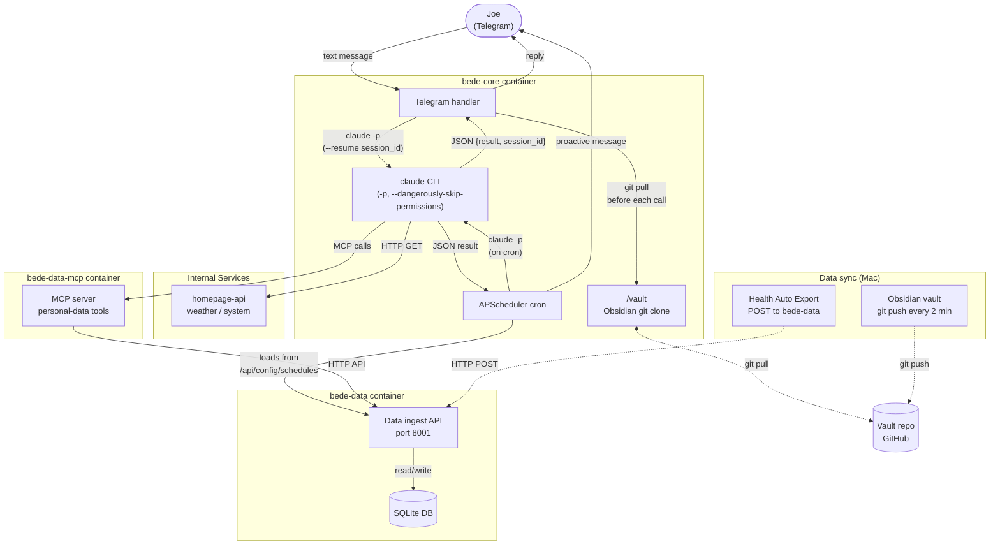

# Bede — Personal AI Assistant

Telegram bot wrapping Claude Code CLI. Runs in Docker on the home server.

## Quick Start

### Prerequisites

1. **Telegram bot token** — create via [@BotFather](https://t.me/BotFather)
2. **Your Telegram user ID** — message [@userinfobot](https://t.me/userinfobot)
3. **Claude credentials on the server** — sync from Mac (see below)

### First-time setup

**1. Add to `.env` on the server:**
```env
TELEGRAM_BOT_TOKEN=your_token_here
ALLOWED_USER_ID=your_numeric_id_here
VAULT_REPO=           # git URL for your Obsidian vault
VAULT_SSH_KEY_PATH=   # host path to SSH key (leave blank for HTTPS PAT)
SESSION_TIMEOUT_MINUTES=10
```

**2. Sync Claude OAuth credentials from Mac to server:**
```bash
security find-generic-password -s "Claude Code-credentials" -w | \
  ssh user@SERVER_IP "cat > ~/.claude/.credentials.json"
```

**3. Create your persona file** — `bede/CLAUDE.md` is gitignored (it's personal). Copy the example and fill in your details:
```bash
cp bede/CLAUDE.md.example bede/CLAUDE.md
# Edit bede/CLAUDE.md — set your name, location, timezone, role, interests
```

**4. Build and start:**
```bash
make bede-build
make bede-start
make logs-bede
```

## Day-to-day Commands

```bash
make bede-start       # Start Bede services
make bede-stop        # Stop all containers
make bede-restart     # Restart all containers
make bede-status      # Show container status
make logs-bede        # Tail Bede logs
make bede-build       # Rebuild after code changes, then make bede-start
```

## Telegram Commands

- `/start` — greeting and available commands
- `/reset` — clear the current session (start a fresh conversation)

## Re-authenticating (when OAuth token expires)

Claude Code refreshes tokens automatically — the credentials file is mounted read-write so it can write updated tokens back to the host. You should rarely need to re-authenticate manually.

If Bede does stop responding with an auth error (e.g. after a very long gap), run from your Mac:

```bash
security find-generic-password -s "Claude Code-credentials" -w | \
  ssh user@SERVER_IP "cat > ~/.claude/.credentials.json"
```

No container restart needed — the credentials file is bind-mounted live.

## Setting Up the Obsidian Vault

### HTTPS PAT (simpler)

Set `VAULT_REPO` to a URL with your PAT embedded:
```
VAULT_REPO=https://<PAT>@github.com/you/obsidian-vault.git
```

Leave `VAULT_SSH_KEY_PATH` blank.

### SSH key (private repo without PAT)

1. Generate a dedicated key on the server:
   ```bash
   ssh-keygen -t ed25519 -f ~/.ssh/bede_vault_key -N "" -C "bede@home-server"
   ```
2. Add the public key as a deploy key on your vault repo (read-only is fine).
3. Set in `.env`:
   ```
   VAULT_REPO=git@github.com:you/obsidian-vault.git
   VAULT_SSH_KEY_PATH=/home/user/.ssh/bede_vault_key
   ```

The vault is cloned on container start and pulled before each Claude invocation.

## Architecture

```
docker-compose.ai.yml
├── bede-core container
│   ├── Telegram bot + scheduler + session manager
│   ├── claude CLI          — installed via official installer
│   ├── /vault              — Obsidian vault (bind mount, git clone on start)
│   └── ~/.claude/.credentials.json  ← bind-mounted from host
├── bede-data container
│   ├── Data ingest API (port 8001)
│   └── SQLite database (shared via bind mount)
└── bede-data-mcp container
    ├── MCP server for personal data tools (port 8002)
    └── Queries bede-data for health, location, vault data
```

Claude Code auto-discovers data-mcp via `.mcp.json` in the working directory, which points to `http://bede-data-mcp:8002/mcp` on the internal Docker network. Sessions are resumable because MCP is configured via the project file rather than the `--mcp-config` flag (which makes sessions unresumable in Claude Code 2.1.x).

## Data Flow



Data flows through two paths:

- **Health & device data** — Health Auto Export on the Mac POSTs Apple Watch/iPhone metrics to the `bede-data` ingest API, which stores them in SQLite. The `data-mcp` tools query this data via the bede-data HTTP API.
- **Obsidian vault** — The Mac pushes git commits to the vault repo containing daily-raw CSV exports (screen time, Safari history, podcasts, Claude session summaries). The `/vault` clone inside bede-core is pulled before every Claude invocation.

## Troubleshooting

### "Credit balance is too low"

The container is picking up `ANTHROPIC_API_KEY` from the shared `.env` instead of using OAuth.
Check `docker-compose.ai.yml` has `ANTHROPIC_API_KEY=` (empty) in the environment block.

### "--dangerously-skip-permissions cannot be used with root"

The container is running as root. The Dockerfile must have `USER bede` before `ENTRYPOINT`.

### "No conversation found with session ID: ..."

Stale session from a previous container run. Send `/reset` on Telegram to clear it.

### Bede stops responding after weeks

OAuth token has expired. Run the re-auth one-liner above from your Mac.

## Phases

| Phase | Status | Description |
|---|---|---|
| 1 | Done | Docker container, Telegram bot, Claude Code integration |
| 2 | Done | Obsidian vault via git, multi-turn sessions |
| 3 | Done | Scheduled tasks via APScheduler |
| 4 | Done | Refactored into separate packages (bede-core, bede-data, bede-data-mcp) |

See `docs/bede-assistant-plan.md` for the full build plan.
